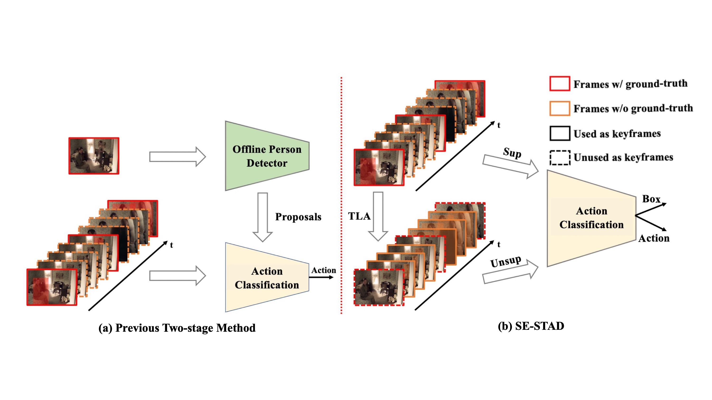

# SE-STAD: A Simple and Efficient Pipeline to Build an End-to-End Spatial-Temporal Action Detector

## Introduction
This repository hodes the official implementation of the paper "A Simple and Efficient Pipeline to Build an End-to-End Spatial-Temporal Action Detector".

We are continuing cleaning the code and we have released part of our code. Our paper is accepted to WACV 2023 and an arXiv version can be found at [this link](https://arxiv.org/pdf/2206.03064.pdf).

<div align="center">
  
</div>

## To-do list
- [ ] (Partially, in progress) Release the ssl part.
- [x] Release the baseline training code.
## Changelog
* 01/03/2022. Initial code release without SSL part.

## Code Overview
Our code is based on MMAction2 and MMDetection2 with some major modification changes.
## Installation
* Follow INSTALL.md for installing necessary dependencies and compiling the code.

## To Reproduce Our Results on AVA
**Download Features and Annotations**
* Please follow the official repo from [AVA Download Page](https://research.google.com/ava/download.html) and [MMAction2 AVA prepare tutorial](https://github.com/open-mmlab/mmaction2/blob/master/tools/data/ava/README.md) to prepare AVA dataset.

**Training and Evaluation**
* Train our SE-STAD with baseline part.

```shell
cd mmaction2
./run/train/slowfast_r50_fcos.sh
```
* Evaluate the trained model.
```shell
cd mmaction2
./run/test/e2e_test.sh
```

* Train our SE-STAD with SSAD part.
```shell
To be filled.
```
## Contact
Chen-Lin Zhang (zclnjucs@gmail.com)

## References
If you are using our code, please consider citing our paper.
```
@inproceedings{sui2023sestad,
  title={A Simple and Efficient Pipeline to Build an End-to-End Spatial-Temporal Action Detector},
  author={Sui, Lin, and Zhang, Chen-Lin and Gu, Lixin and Han Feng},
  booktitle={Proceedings of the IEEE/CVF Winter Conference on Applications of Computer Vision (WACV)},
  month={January},
  year={2023},
  pages={in press}
}
```
